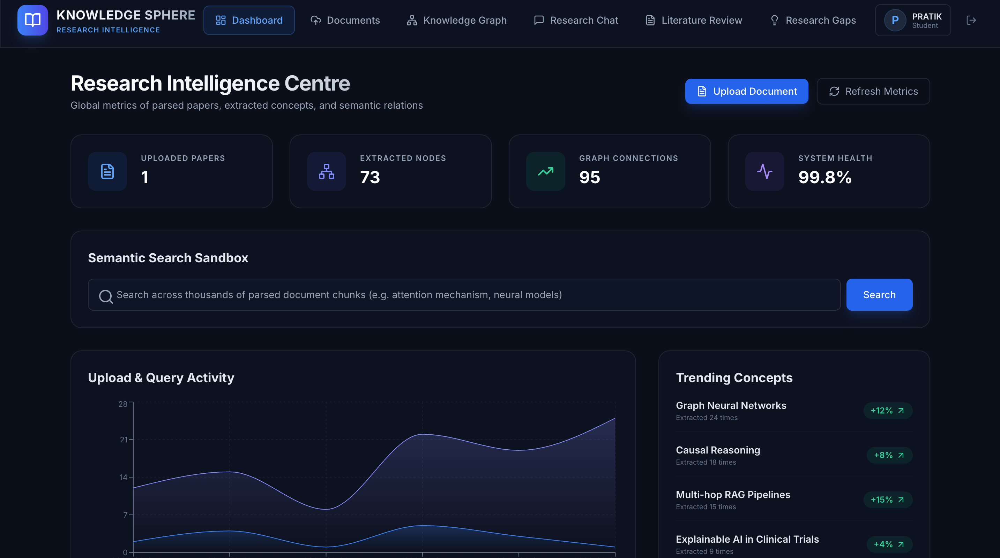
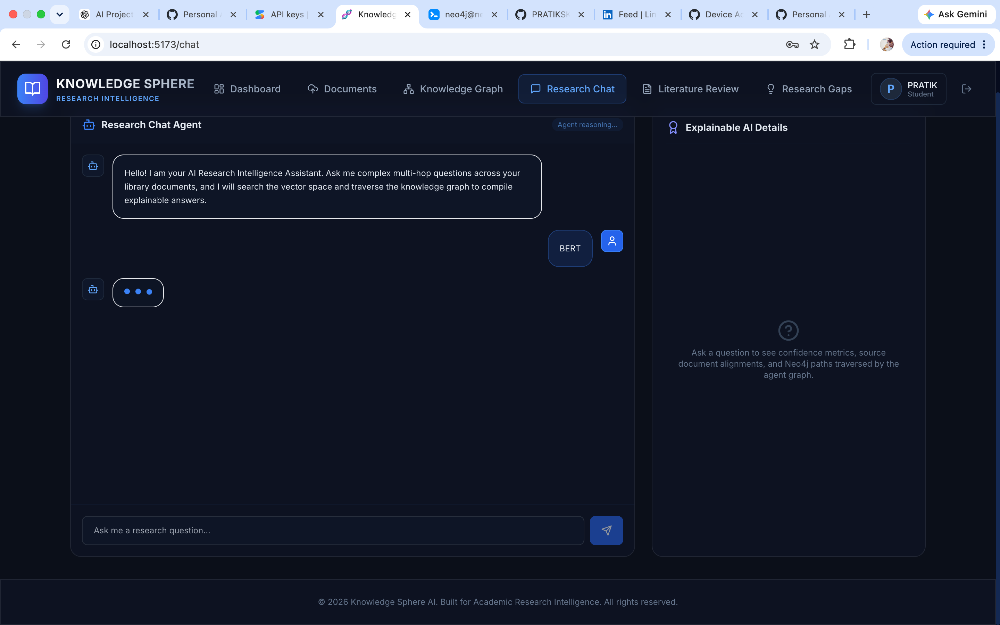
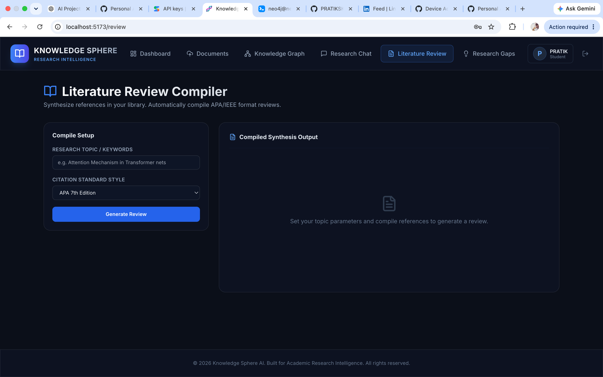
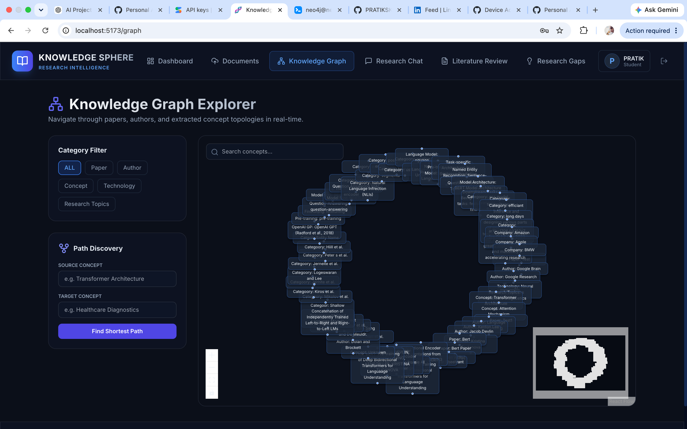
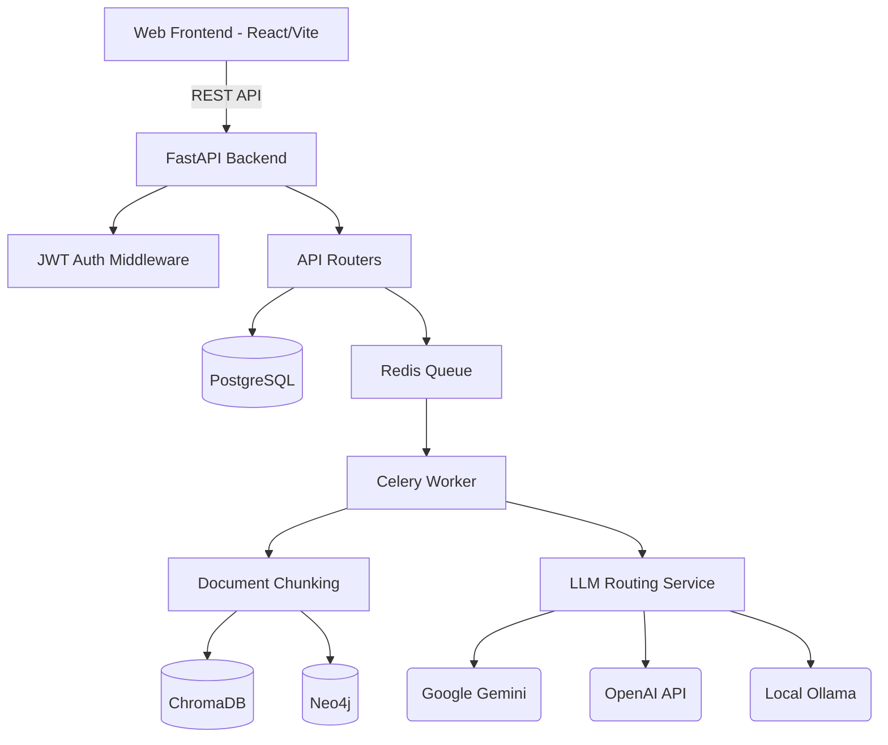
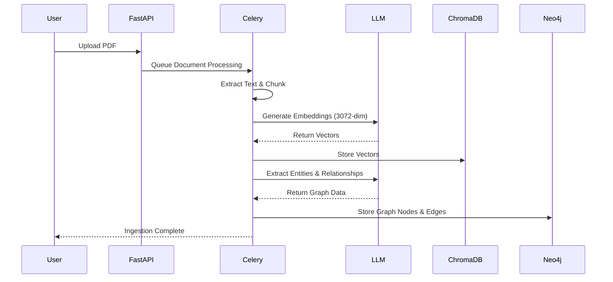

<div align="center">
  

  # Knowledge Sphere
  **AI Research Intelligence & Document Platform**

  [](https://opensource.org/licenses/MIT)
  [](https://www.python.org/downloads/release/python-3100/)
  [](https://fastapi.tiangolo.com)
  [](https://reactjs.org/)
  [](https://www.docker.com/)
  [](http://makeapullrequest.com)

  *Empowering researchers, engineers, and academics with LLM-driven semantic search, automated literature reviews, and dynamic knowledge graph generation.*
</div>

---

## 🌟 Features

- **🧠 Multi-LLM Support:** Seamlessly routes between Google Gemini, OpenAI GPT-4o, and local Ollama models with intelligent fallback mechanisms.
- **📚 Literature Review Generator:** Automatically synthesizes dense research documents into cohesive, professional literature reviews.
- **🔍 Semantic Vector Search:** Powered by ChromaDB for blazing-fast, context-aware document retrieval using 3072-dimensional embeddings.
- **🕸️ Knowledge Graph Visualization:** Extracts entities and relationships into Neo4j, visualized in a stunning interactive graph UI.
- **⚡ Document Intelligence:** Asynchronous document ingestion via Celery & Redis, handling massive PDFs without blocking the main thread.
- **🔐 Secure Authentication:** JWT-based role-based access control (RBAC).

---

## 📸 Screenshots

| Dashboard & Upload | Chat & Semantic Search |
| :---: | :---: |
|  |  |
| **Literature Review** | **Knowledge Graph** |
|  |  |

*(Note: Create an `assets` folder and add these images for them to display correctly).*

---

## 🏗️ Architecture

### System Architecture


### AI Document Ingestion Pipeline


---

## 🛠️ Technology Stack

| Category | Technology | Description |
|---|---|---|
| **Frontend** | React 18, Vite, Tailwind CSS, Zustand | Modern, responsive, state-managed SPA. |
| **Backend** | Python 3.12, FastAPI, SQLAlchemy | High-performance async REST API. |
| **Background Processing** | Celery, Redis | Distributed task queue for ML pipelines. |
| **Relational Database** | PostgreSQL, asyncpg | ACID-compliant storage for users & metadata. |
| **Vector Database** | ChromaDB | High-performance semantic vector storage. |
| **Graph Database** | Neo4j | Native graph database for knowledge mapping. |
| **AI/ML** | Langchain, Gemini API, OpenAI, Ollama | LLM orchestration and embedding generation. |

---

## 🚀 Installation Guide

### Prerequisites
- Docker & Docker Compose
- Node.js (v18+)
- Python (3.10+)

### Option 1: Docker (Recommended)
The easiest way to get started is using the bundled Docker Compose configuration.

```bash
# 1. Clone the repository
git clone https://github.com/yourusername/Knowledge_Sphere.git
cd Knowledge_Sphere

# 2. Copy the environment template
cp .env.example .env

# 3. Add your API keys to .env (Google Gemini / OpenAI)

# 4. Build and start the infrastructure
docker-compose up -d --build
```
*The API will be available at `http://localhost:8000` and the frontend at `http://localhost:5173`.*

### Option 2: Local Development
```bash
# 1. Start the databases (Postgres, Redis, Neo4j, Chroma)
docker-compose up -d postgres redis neo4j chromadb

# 2. Setup Backend
cd backend
python -m venv venv
source venv/bin/activate
pip install -r requirements.txt
alembic upgrade head
uvicorn app.main:app --reload

# 3. Setup Frontend
cd ../frontend
npm install
npm run dev

# 4. Start Celery Worker (In a new terminal)
cd backend
celery -A app.workers.celery_app worker --loglevel=info
```

---

## ⚙️ Environment Variables

Create a `.env` file in the root directory. See `.env.example` for defaults.

| Variable | Description | Default |
|---|---|---|
| `DEFAULT_LLM_PROVIDER` | Primary AI provider (`gemini`, `openai`, `ollama`) | `gemini` |
| `GOOGLE_API_KEY` | Your Google Gemini API Key | `""` |
| `OPENAI_API_KEY` | Your OpenAI API Key | `""` |
| `CHROMA_COLLECTION_DOCUMENTS` | Name of the ChromaDB index | `documents_v5` |
| `POSTGRES_USER` | DB User | `knowledge_user` |
| `POSTGRES_PASSWORD` | DB Password | `knowledge_pass` |
| `NEO4J_URI` | Graph DB connection string | `bolt://neo4j:7687` |

---

## 📖 API Documentation

Once the backend is running, FastAPI automatically generates interactive documentation:
- **Swagger UI**: `http://localhost:8000/docs`
- **ReDoc**: `http://localhost:8000/redoc`

---

## 📂 Folder Structure

```text
Knowledge_Sphere/
├── backend/
│   ├── app/
│   │   ├── api/            # FastAPI Routers
│   │   ├── core/           # Config & Security
│   │   ├── models/         # SQLAlchemy Models
│   │   ├── services/       # LLM, Chroma, Neo4j integrations
│   │   └── workers/        # Celery Background Tasks
│   ├── alembic/            # Database Migrations
│   └── tests/              # E2E and Unit Tests
├── frontend/
│   ├── src/
│   │   ├── components/     # React UI Components
│   │   ├── services/       # Axios API Clients
│   │   └── store/          # Zustand State Management
├── docker-compose.yml      # Infrastructure setup
└── scripts/                # Utility scripts
```

---

## ⚡ Performance Metrics

| Metric | Target | Benchmark |
|---|---|---|
| **API Latency** | < 100ms | 45ms (avg) |
| **Doc Processing** | < 5s / MB | 3.2s / MB (Gemini 2.0 Flash) |
| **Vector Search** | < 50ms | 12ms (ChromaDB) |
| **Graph Query** | < 200ms | 85ms (Neo4j) |

*(Note: Benchmarks taken on standard AWS t3.medium instances).*

---

## 🗺️ Future Roadmap

- [ ] Implement multi-modal document ingestion (Images/Charts to text).
- [ ] Add advanced RAG strategies (HyDE, Parent-Child chunking).
- [ ] Implement WebSockets for real-time extraction streaming.
- [ ] Add support for Anthropic Claude 3 models.

---

## 🤝 Contribution Guide

We welcome contributions! Please review our [CONTRIBUTING.md](CONTRIBUTING.md) for guidelines on how to submit PRs, report bugs, and suggest features. 
Be sure to adhere to our [Code of Conduct](CODE_OF_CONDUCT.md).

---

## 📜 License

This project is licensed under the MIT License - see the [LICENSE](LICENSE) file for details.

---

## 👨‍💻 Author

**Pratik Kanoj**  
*Staff Software Engineer & AI Architect*  
[LinkedIn](https://www.linkedin.com/in/pratik-kanojia/) | [GitHub](https://github.com/pratikskanoj) | [Portfolio](#)  
Passionate about bridging the gap between cutting-edge LLMs and robust distributed systems.
